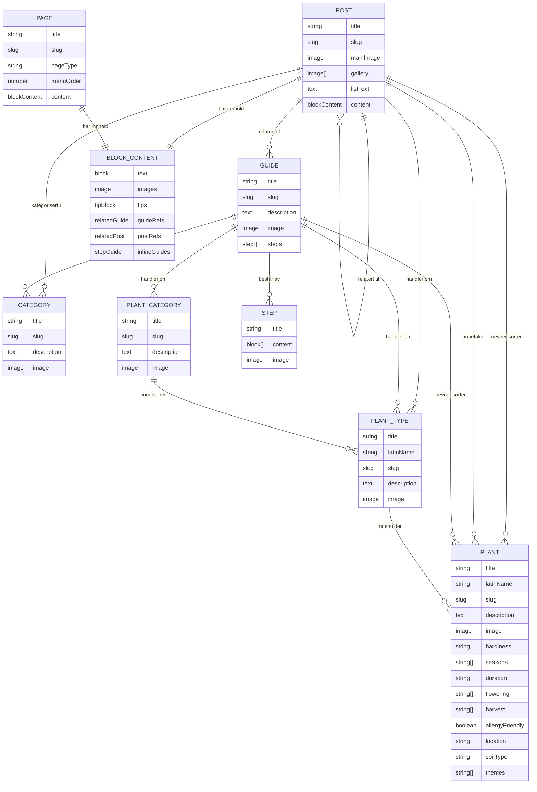
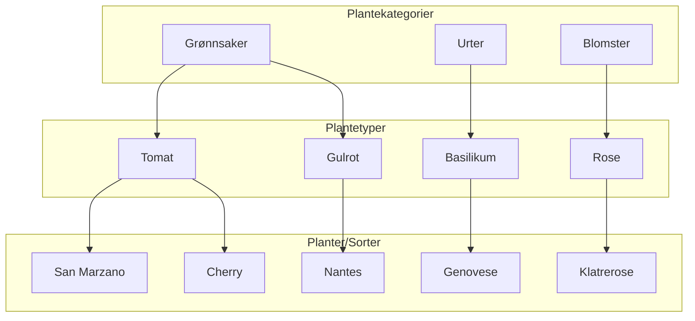
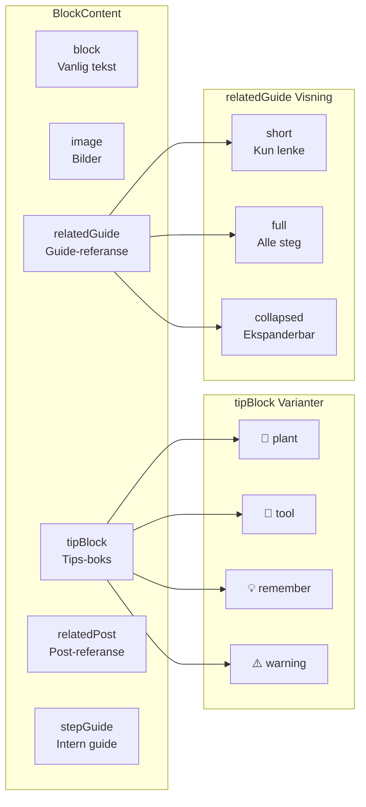
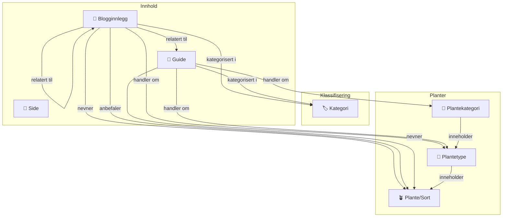
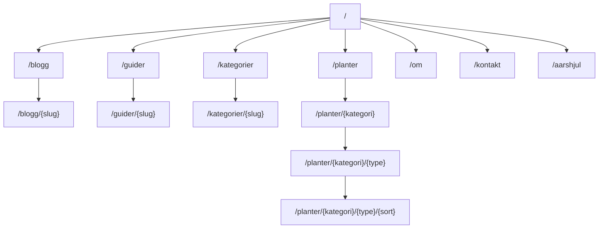
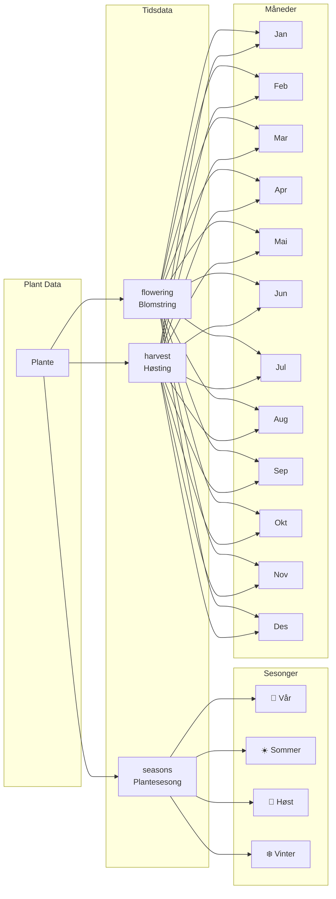

# Schema-diagram for Martines Hage

## Hovedoversikt

```mermaid
erDiagram
    POST ||--o{ CATEGORY : "kategorisert i"
    POST ||--o{ PLANT_TYPE : "handler om"
    POST ||--o{ PLANT : "nevner sorter"
    POST ||--o{ POST : "relatert til"
    POST ||--o{ GUIDE : "relatert til"
    POST ||--o{ PLANT : "anbefaler"
    POST ||--|| BLOCK_CONTENT : "har innhold"

    GUIDE ||--o{ PLANT_TYPE : "handler om"
    GUIDE ||--o{ PLANT : "nevner sorter"
    GUIDE ||--o{ PLANT_CATEGORY : "handler om"
    GUIDE ||--o{ CATEGORY : "kategorisert i"
    GUIDE ||--o{ STEP : "består av"

    PAGE ||--|| BLOCK_CONTENT : "har innhold"

    PLANT_CATEGORY ||--o{ PLANT_TYPE : "inneholder"
    PLANT_TYPE ||--o{ PLANT : "inneholder"

    POST {
        string title
        slug slug
        image mainImage
        image[] gallery
        text listText
        blockContent content
    }

    GUIDE {
        string title
        slug slug
        text description
        image image
        step[] steps
    }

    STEP {
        string title
        block[] content
        image image
    }

    PAGE {
        string title
        slug slug
        string pageType
        number menuOrder
        blockContent content
    }

    CATEGORY {
        string title
        slug slug
        text description
        image image
    }

    PLANT_CATEGORY {
        string title
        slug slug
        text description
        image image
    }

    PLANT_TYPE {
        string title
        string latinName
        slug slug
        text description
        image image
    }

    PLANT {
        string title
        string latinName
        slug slug
        text description
        image image
        string hardiness
        string[] seasons
        string duration
        string[] flowering
        string[] harvest
        boolean allergyFriendly
        string location
        string soilType
        string[] themes
    }

    BLOCK_CONTENT {
        block text
        image images
        tipBlock tips
        relatedGuide guideRefs
        relatedPost postRefs
        stepGuide inlineGuides
    }
```

## Plantehierarki

```mermaid
flowchart TD
    subgraph Plantekategorier
        PC1[Grønnsaker]
        PC2[Urter]
        PC3[Blomster]
    end

    subgraph Plantetyper
        PT1[Tomat]
        PT2[Gulrot]
        PT3[Basilikum]
        PT4[Rose]
    end

    subgraph Planter/Sorter
        P1[San Marzano]
        P2[Cherry]
        P3[Nantes]
        P4[Genovese]
        P5[Klatrerose]
    end

    PC1 --> PT1
    PC1 --> PT2
    PC2 --> PT3
    PC3 --> PT4

    PT1 --> P1
    PT1 --> P2
    PT2 --> P3
    PT3 --> P4
    PT4 --> P5
```

## BlockContent (Rik tekst)

```mermaid
flowchart LR
    subgraph BlockContent
        direction TB
        B[block<br/>Vanlig tekst]
        I[image<br/>Bilder]
        T[tipBlock<br/>Tips-boks]
        RG[relatedGuide<br/>Guide-referanse]
        RP[relatedPost<br/>Post-referanse]
        SG[stepGuide<br/>Intern guide]
    end

    subgraph tipBlock Varianter
        V1[🌱 plant]
        V2[🔧 tool]
        V3[💡 remember]
        V4[⚠️ warning]
    end

    subgraph relatedGuide Visning
        D1[short<br/>Kun lenke]
        D2[full<br/>Alle steg]
        D3[collapsed<br/>Ekspanderbar]
    end

    T --> V1
    T --> V2
    T --> V3
    T --> V4

    RG --> D1
    RG --> D2
    RG --> D3
```

## Innholdsflyt

```mermaid
flowchart TD
    subgraph Innhold
        POST[📝 Blogginnlegg]
        GUIDE[📖 Guide]
        PAGE[📄 Side]
    end

    subgraph Klassifisering
        CAT[🏷️ Kategori]
    end

    subgraph Planter
        PCAT[🌿 Plantekategori]
        PTYPE[🌱 Plantetype]
        PLANT[🪴 Plante/Sort]
    end

    POST -->|kategorisert i| CAT
    POST -->|handler om| PTYPE
    POST -->|nevner| PLANT
    POST -->|relatert til| POST
    POST -->|relatert til| GUIDE
    POST -->|anbefaler| PLANT

    GUIDE -->|kategorisert i| CAT
    GUIDE -->|handler om| PTYPE
    GUIDE -->|handler om| PCAT
    GUIDE -->|nevner| PLANT

    PCAT -->|inneholder| PTYPE
    PTYPE -->|inneholder| PLANT
```

## URL-struktur

```mermaid
flowchart TD
    ROOT["/"] --> BLOGG["/blogg"]
    ROOT --> GUIDER["/guider"]
    ROOT --> KATEGORIER["/kategorier"]
    ROOT --> PLANTER["/planter"]
    ROOT --> OM["/om"]
    ROOT --> KONTAKT["/kontakt"]
    ROOT --> AARSHJUL["/aarshjul"]

    BLOGG --> BLOGG_SLUG["/blogg/{slug}"]
    GUIDER --> GUIDER_SLUG["/guider/{slug}"]
    KATEGORIER --> KAT_SLUG["/kategorier/{slug}"]

    PLANTER --> PLANTER_KAT["/planter/{kategori}"]
    PLANTER_KAT --> PLANTER_TYPE["/planter/{kategori}/{type}"]
    PLANTER_TYPE --> PLANTER_SORT["/planter/{kategori}/{type}/{sort}"]
```

## Årshjul-data

```mermaid
flowchart LR
    subgraph Plant Data
        PLANT[Plante]
    end

    subgraph Tidsdata
        S[seasons<br/>Plantesesong]
        F[flowering<br/>Blomstring]
        H[harvest<br/>Høsting]
    end

    subgraph Sesonger
        SPR[🌱 Vår]
        SUM[☀️ Sommer]
        AUT[🍂 Høst]
        WIN[❄️ Vinter]
    end

    subgraph Måneder
        M1[Jan]
        M2[Feb]
        M3[Mar]
        M4[Apr]
        M5[Mai]
        M6[Jun]
        M7[Jul]
        M8[Aug]
        M9[Sep]
        M10[Okt]
        M11[Nov]
        M12[Des]
    end

    PLANT --> S
    PLANT --> F
    PLANT --> H

    S --> SPR
    S --> SUM
    S --> AUT
    S --> WIN

    F --> M1
    F --> M2
    F --> M3
    F --> M4
    F --> M5
    F --> M6
    F --> M7
    F --> M8
    F --> M9
    F --> M10
    F --> M11
    F --> M12

    H --> M1
    H --> M2
    H --> M3
    H --> M4
    H --> M5
    H --> M6
    H --> M7
    H --> M8
    H --> M9
    H --> M10
    H --> M11
    H --> M12
```
